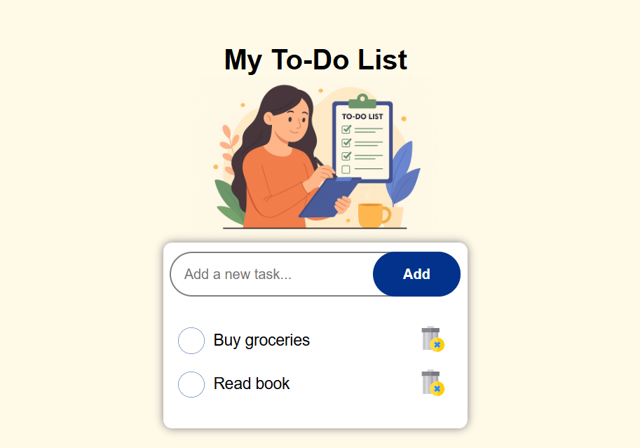

# 📝 To-Do List App

A simple and interactive To-Do List web app built with HTML, CSS, and JavaScript.
It helps users organize tasks efficiently by adding, marking as complete, and deleting them — all with a clean UI and smooth user experience.

## 🚀 Features

  - ➕ Add new tasks easily

  - ✅ Mark tasks as completed

  - ❌ Delete tasks you no longer need

  - 💾 Saves your list using Local Storage (data stays even after refresh)

  - 📱 Fully responsive and mobile-friendly design

## 🧠 Tech Stack

  - HTML5 — Structure

  - CSS3 — Styling and responsiveness

  - JavaScript (ES6) — Functionality and logic

## ⚙️ Installation & Usage

1. Clone the repository

    ```bash

    git clone https://github.com/yourusername/todo-list.git


2. Navigate to the folder

    ```bash
  
    cd todo-list


3. Open the project
   Just open index.html in your browser.

## 🌐 Live Demo

👉 [Click here to open the website](https://todolist-app-mini-project.netlify.app/)

## 📸 Screenshot
    

## 🏗️ Future Improvements

  - Add task categories or filters (Work, Personal, etc.)

  - Add dark/light theme toggle

  - Enable drag-and-drop reordering of tasks

## 📜 License

   This project is licensed under the MIT License — you’re free to use and modify it.


   [](https://opensource.org/licenses/MIT)
